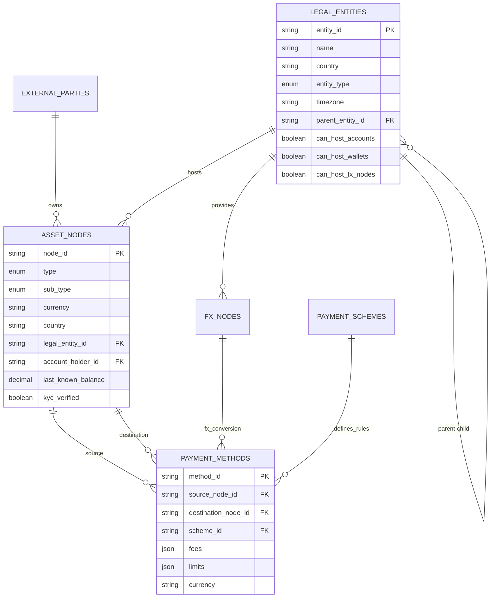

# Epic 1: Core Database Infrastructure

## Epic Description
Establish the foundational database schema and data access layer for storing the payment network graph. This epic creates the core data models that will represent legal entities, payment schemes, external parties, asset nodes (bank accounts/crypto wallets), FX nodes, and payment methods as edges connecting the graph.

## Goals & Objectives
1. **Foundation for Graph Modeling**: Create a robust database schema that can represent the payment network as a connected graph
2. **Scalable Data Architecture**: Design tables that support the complex relationships between entities, accounts, and payment methods
3. **Data Integrity**: Implement proper constraints, validations, and referential integrity
4. **Performance Optimization**: Structure data for efficient querying and graph traversal operations
5. **Compliance Ready**: Include fields necessary for KYC, regulatory reporting, and audit trails

## Success Criteria / Key Performance Indicators (KPIs)
- ✅ All 6 core data models implemented with proper schema
- ✅ Database migrations successfully create all tables with constraints
- ✅ Foreign key relationships properly established
- ✅ Basic CRUD operations functional for all entities
- ✅ Data validation rules enforced at database level
- ✅ Performance benchmarks: <100ms for single entity queries, <500ms for complex joins
- ✅ Zero data integrity violations in testing scenarios

## Out of Scope
- User interface components (covered in later epics)
- Advanced querying and analytics features
- Performance optimization for high-volume production loads
- Integration with external banking/crypto APIs
- Real-time data synchronization
- Advanced security features beyond basic data validation

## High-level User Personas Involved
- **System Administrators**: Need to configure and maintain the foundational data structures
- **Data Architects**: Require well-structured schemas for building upon
- **Backend Developers**: Will build APIs and services on top of these data models
- **Business Analysts**: Need reliable data foundation for network analysis and reporting
- **Compliance Officers**: Require proper data fields for regulatory and audit purposes

## Technical Architecture Overview
The database infrastructure will use PostgreSQL with the following core entities:

## Dependencies
- PostgreSQL database setup and configuration
- Knex.js migration system configuration
- Basic NestJS application structure
- Environment configuration for database connections

## Risk Assessment
- **Medium Risk**: Complex foreign key relationships may require careful migration ordering
- **Low Risk**: Database performance with initial dataset sizes
- **Medium Risk**: Schema evolution as requirements become clearer during development

## Success Metrics
- All database tables created successfully
- Foreign key constraints properly enforced
- Basic entity creation/retrieval operations working
- Migration system functional for schema evolution
- Performance targets met for basic operations
