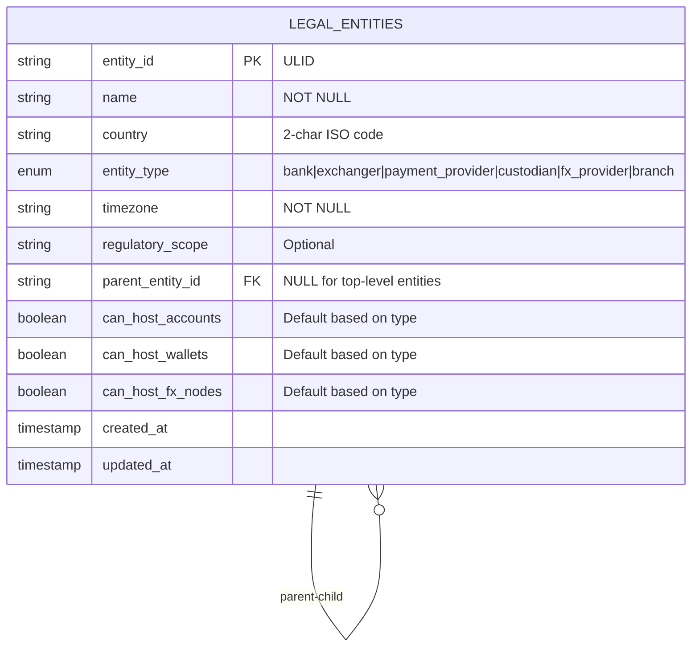
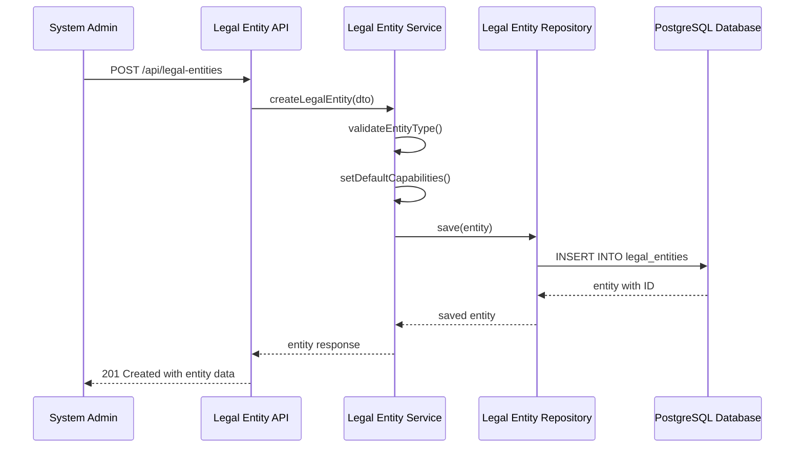

# Story 1: Legal Entity Data Model

## Title
Implement Legal Entity Data Model and Management System

## Description
**As a** system administrator  
**I want** to define and store legal entities (banks, exchanges, custodians, payment providers)  
**So that** all accounts and wallets can be properly associated with their providers and the payment network graph has a solid foundation

## Acceptance Criteria

1. **Given** a system administrator needs to create a legal entity, **when** they provide valid entity details (name, country, type, timezone), **then** the entity is created successfully with a unique ULID identifier

2. **Given** a legal entity of type 'branch', **when** it is created, **then** it must reference a valid parent entity and inherit capabilities from the parent

3. **Given** a legal entity is created, **when** entity type capabilities are set, **then** the system enforces that only banks can host bank accounts, only exchanges/custodians can host crypto wallets, and only FX providers can host FX nodes

4. **Given** multiple legal entities exist, **when** querying for entities, **then** the system returns paginated results with filtering by country, type, and parent entity

5. **Given** a legal entity has dependent asset nodes, **when** attempting to delete the entity, **then** the system prevents deletion and returns appropriate error message

6. **Given** valid legal entity data, **when** performing CRUD operations via API, **then** all operations complete within 100ms for single entity operations

## Architecture

### Database Schema

### API Flow

## Technical Design Considerations

### Security
- All entity IDs use ULIDs for non-sequential, secure identifiers
- Input validation prevents injection attacks
- Audit logging for all entity modifications
- Rate limiting on entity creation endpoints

### Validation
- Entity type enum validation with specific allowed values
- Country code validation against ISO 3166-1 alpha-2 standard  
- Timezone validation against standard timezone database
- Parent entity validation ensures no circular references
- Capability validation ensures type-appropriate permissions

### Performance
- Database indexes on entity_id (primary), parent_entity_id, entity_type, and country
- Efficient pagination using cursor-based pagination for large datasets
- Query optimization for hierarchical entity traversal
- Caching strategy for frequently accessed entities

### Database Constraints
- Foreign key constraint on parent_entity_id references legal_entities(entity_id)
- Check constraints for entity type capabilities based on type
- Unique constraint on (name, country) to prevent duplicate entities
- Cascade rules for parent-child relationships

### Integration Considerations
- Repository pattern for clean data access abstraction
- DTO validation using class-validator decorators
- Swagger documentation for all API endpoints
- Error handling with appropriate HTTP status codes
- Logging for audit trails and debugging

### Scalability
- Table partitioning strategy for large entity datasets
- Efficient querying patterns for parent-child hierarchies
- Bulk operations support for entity management
- Archive strategy for inactive entities
