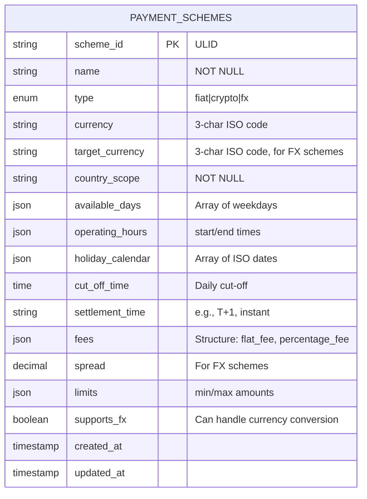
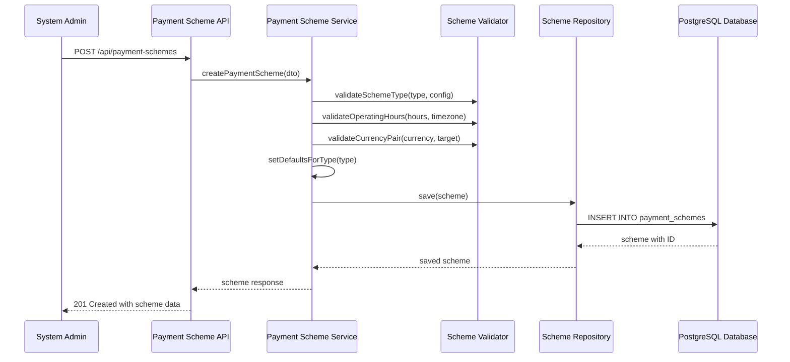

# Story 2: Payment Scheme Data Model

## Title
Implement Payment Scheme Data Model and Configuration System

## Description
**As a** system administrator  
**I want** to define payment schemes (SEPA, SWIFT, crypto networks, FX venues)  
**So that** payment methods can inherit baseline rules, characteristics, and operational constraints for the payment network

## Acceptance Criteria

1. **Given** a system administrator needs to create a payment scheme, **when** they provide scheme details (name, type, currency, operating hours), **then** the scheme is created with proper validation and default configurations

2. **Given** a payment scheme with type 'fiat', **when** it is configured, **then** it must include target currency, operating days/hours, cut-off times, and settlement periods appropriate for traditional banking

3. **Given** a payment scheme with type 'crypto', **when** it is configured, **then** it must include blockchain network details, confirmation requirements, and 24/7 availability settings

4. **Given** a payment scheme with type 'fx', **when** it is configured, **then** it must include currency pair definitions, spread configurations, and FX-specific settlement times

5. **Given** payment schemes are configured, **when** payment methods are created, **then** they inherit base configurations from their assigned scheme but can override specific parameters

6. **Given** time-based availability rules, **when** schemes define operating hours and holiday calendars, **then** the system properly validates time windows and supports multiple timezone considerations

## Architecture

### Database Schema

### Configuration Flow

## Technical Design Considerations

### Security
- Scheme configuration validation prevents invalid operational parameters
- Fee and spread configurations protected from unauthorized modification
- Audit logging for all scheme configuration changes
- Access control for scheme modification operations

### Validation
- Scheme type-specific validation rules (fiat vs crypto vs fx)
- Currency code validation against ISO 4217 standard
- Operating hours validation with timezone considerations
- Holiday calendar validation with ISO date format
- Fee structure validation (positive values, reasonable ranges)
- Spread validation for FX schemes (within market norms)

### Performance  
- Database indexes on scheme_id, type, currency, and country_scope
- JSON field indexing for frequently queried operational parameters
- Efficient querying for scheme lookup during payment method creation
- Caching of active schemes for real-time payment processing

### Database Design
- JSON fields for flexible configuration storage (operating_hours, fees, limits)
- Check constraints on enum values and positive fee amounts
- Partial indexes for active vs archived schemes
- Foreign key preparation for future payment_methods table

### Time Zone Handling
- Operating hours stored in UTC with timezone metadata
- Holiday calendar support for multiple jurisdictions
- Cut-off time calculations across different time zones
- Support for schemes operating in multiple regions

### Configuration Flexibility
- JSON schema validation for complex configuration objects
- Default value inheritance based on scheme type
- Override capabilities for payment methods
- Version control for scheme configuration changes

### Integration Points
- Repository pattern with clean data access abstraction
- DTO validation using class-validator with custom validators
- Swagger documentation with detailed configuration examples
- Error handling for configuration validation failures
- Event system for scheme configuration changes

### Scalability Considerations
- Efficient scheme lookup patterns for payment processing
- Bulk configuration update capabilities
- Archive strategy for obsolete payment schemes
- Support for scheme versioning and migration
