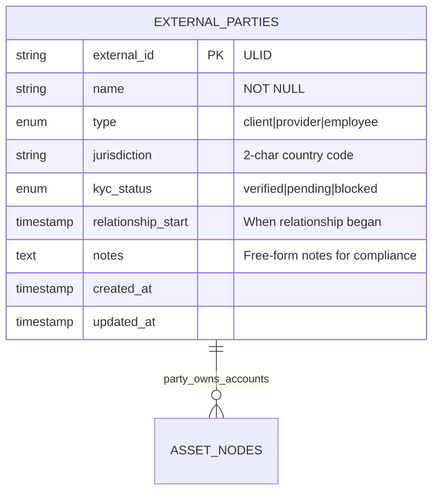
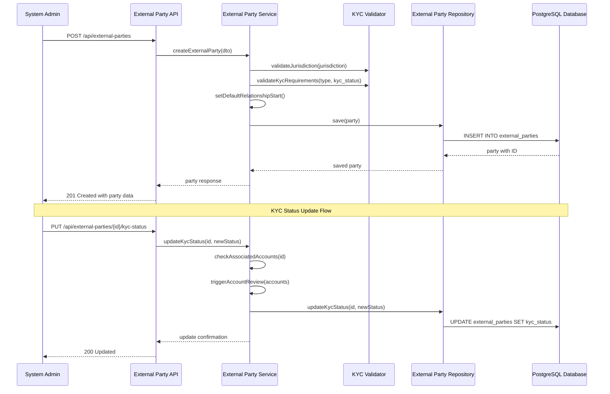

# Story 3: External Parties Data Model

## Title
Implement External Parties Data Model and Management System

## Description
**As a** system administrator  
**I want** to define external parties (clients, providers, employees)  
**So that** external accounts can be properly categorized, managed with appropriate KYC status, and associated with the correct party types in the payment network

## Acceptance Criteria

1. **Given** a system administrator needs to register an external party, **when** they provide party details (name, type, jurisdiction, KYC status), **then** the party is created with proper validation and compliance tracking

2. **Given** an external party of type 'client', **when** it is registered, **then** it must have verified KYC status before any high-value external accounts can be associated

3. **Given** an external party of type 'provider', **when** it is created, **then** it must include relationship start date and can have multiple associated external accounts for services provided

4. **Given** an external party of type 'employee', **when** it is registered, **then** it requires valid jurisdiction and can have associated internal testing accounts with appropriate access controls

5. **Given** external parties with different KYC statuses, **when** querying parties, **then** the system supports filtering by type, jurisdiction, KYC status, and relationship status

6. **Given** an external party has associated external accounts, **when** attempting to change KYC status to 'blocked', **then** all associated accounts are automatically flagged for review

## Architecture

### Database Schema

### KYC Status Management Flow

## Technical Design Considerations

### Security
- External party IDs use ULIDs for secure, non-sequential identification
- KYC status changes trigger audit events and compliance notifications
- Access control for external party management based on user roles
- Data encryption for sensitive party information and notes

### Validation
- Party type enum validation with strict allowed values
- Jurisdiction validation against ISO 3166-1 alpha-2 country codes
- KYC status workflow validation (pending->verified/blocked transitions)
- Relationship start date validation (cannot be future date)
- Name validation with special character handling for international names

### Performance
- Database indexes on external_id (primary), type, jurisdiction, and kyc_status
- Composite indexes for common query patterns (type + kyc_status)
- Efficient filtering and pagination for large party datasets
- Query optimization for party-account relationship lookups

### Database Constraints
- Check constraints on enum values and valid date ranges
- Unique constraint consideration for (name, jurisdiction, type) combinations
- Foreign key preparation for future asset_nodes relationship
- Trigger setup for KYC status change notifications

### Compliance & Audit
- Complete audit trail for all party data modifications
- KYC status change logging with timestamps and user attribution
- Compliance reporting capabilities for regulatory requirements
- Data retention policies for external party information

### Integration Points
- Repository pattern for clean data access abstraction
- Event system for KYC status changes affecting accounts
- DTO validation using class-validator with custom business rules
- Swagger documentation with compliance-focused examples
- Error handling for regulatory validation failures

### Business Rules
- Client parties require verified KYC before high-value account association
- Provider parties can have pending KYC with restricted account types
- Employee parties have special access controls and testing account privileges
- Blocked parties trigger automatic review of all associated accounts

### Data Privacy
- GDPR compliance considerations for EU jurisdiction parties
- Data anonymization capabilities for archived relationships
- Secure handling of party notes and sensitive information
- Right to be forgotten implementation for terminated relationships

### Scalability Considerations
- Efficient party lookup patterns for account creation workflows
- Bulk party management operations for onboarding scenarios
- Archive strategy for terminated party relationships
- Performance optimization for large-scale compliance reporting
