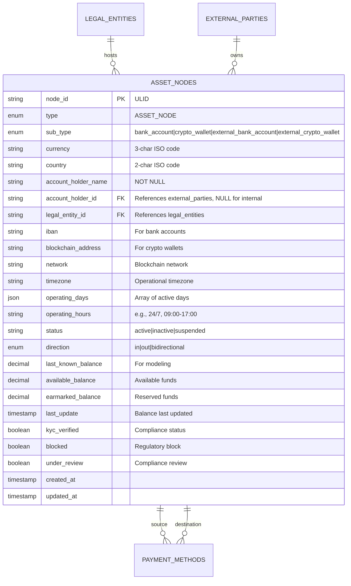
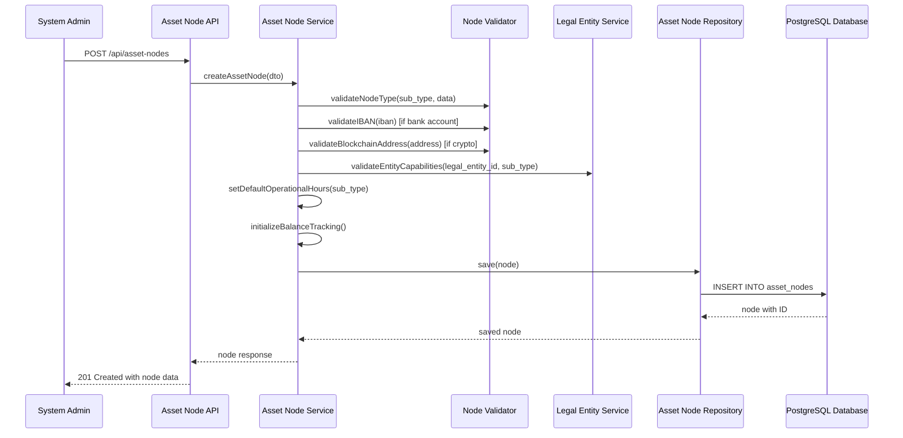

# Story 4: Asset Nodes Data Model

## Title
Implement Asset Nodes Data Model with Polymorphic Account and Wallet Support

## Description
**As a** system administrator  
**I want** to define asset nodes (bank accounts, crypto wallets, external accounts)  
**So that** the payment network graph can represent all types of financial accounts as nodes with proper balance tracking, compliance status, and operational constraints

## Acceptance Criteria

1. **Given** a system administrator needs to create an asset node, **when** they specify node type (bank_account, crypto_wallet, external_bank_account, external_crypto_wallet), **then** the system creates the node with type-specific validation and required fields

2. **Given** an asset node of type 'bank_account', **when** it is created, **then** it must include IBAN, currency, hosting legal entity, and operational hours, with automatic validation of IBAN format and entity capabilities

3. **Given** an asset node of type 'crypto_wallet', **when** it is created, **then** it must include blockchain address, network specification, currency, and 24/7 operational availability

4. **Given** external asset nodes (external_bank_account, external_crypto_wallet), **when** they are created, **then** they must reference a valid external party and include appropriate KYC verification status

5. **Given** asset nodes with balance information, **when** balance updates occur, **then** the system tracks available balance, earmarked balance, and last update timestamp for modeling purposes

6. **Given** asset nodes with compliance requirements, **when** KYC or blocking status changes, **then** all associated payment methods are automatically updated and flagged for review

## Architecture

### Database Schema

### Node Creation Flow

## Technical Design Considerations

### Security
- Node IDs use ULIDs for secure, non-sequential identification
- Balance information access restricted based on user permissions
- Blockchain address validation prevents invalid/malicious addresses
- IBAN validation with checksum verification
- Audit logging for all balance updates and status changes

### Validation
- Polymorphic validation based on sub_type (bank vs crypto specific fields)
- IBAN format validation using industry standard algorithms
- Blockchain address validation per network (Bitcoin, Ethereum, etc.)
- Legal entity capability validation (banks can host bank accounts, etc.)
- Currency code validation against supported currencies
- Balance validation (non-negative values, precision limits)

### Performance
- Database indexes on node_id, legal_entity_id, currency, sub_type, and status
- Composite indexes for common query patterns (legal_entity + sub_type)
- Partial indexes for active vs inactive nodes
- Efficient balance query patterns for reporting
- Optimized polymorphic queries using sub_type discrimination

### Database Design
- Polymorphic table design with type-specific optional fields
- Check constraints ensuring required fields per sub_type
- Balance precision using DECIMAL for accurate financial calculations
- JSON fields for flexible operational configuration
- Foreign key constraints with appropriate cascade rules

### Balance Tracking
- Separate fields for available vs earmarked balance modeling
- Timestamp tracking for balance update audit trails
- Precision handling for different currency decimal places
- Balance reconciliation capabilities for accuracy verification
- Historical balance tracking preparation

### Compliance Integration
- KYC status propagation to associated payment methods
- Blocking status enforcement across all node operations
- Review status workflow for compliance team management
- Integration with external party KYC status changes
- Regulatory reporting data structure

### Operational Constraints
- Operating hours enforcement for traditional banking nodes
- 24/7 availability for crypto nodes with network status consideration
- Timezone-aware operational window calculations
- Holiday calendar integration for bank account nodes
- Direction constraints for specialized accounts (in-only, out-only)

### Integration Points
- Repository pattern with polymorphic query support
- Event system for balance changes and status updates
- DTO validation with sub_type specific rules
- Swagger documentation with polymorphic examples
- Error handling for validation and constraint violations

### Scalability Considerations
- Efficient node lookup patterns for payment processing
- Bulk balance update capabilities for batch processing
- Archive strategy for inactive or closed accounts
- Performance optimization for large-scale balance queries
- Horizontal scaling preparation for high-volume scenarios
