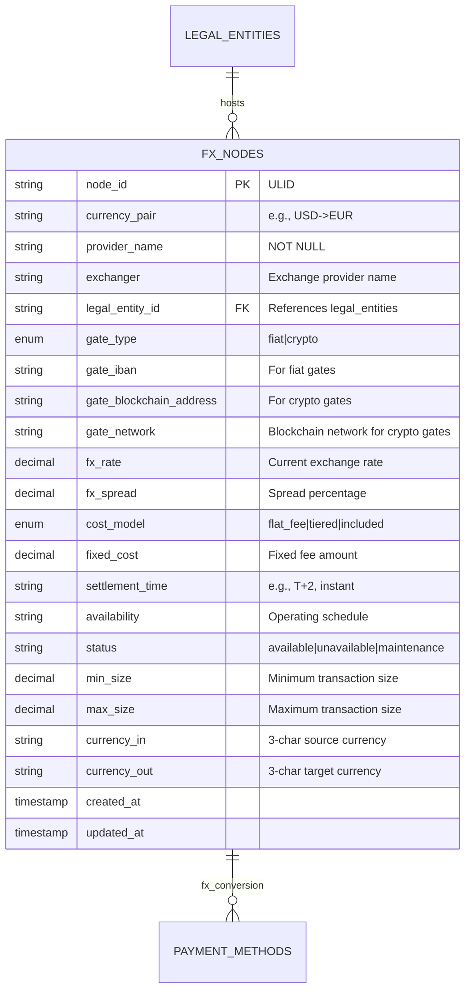
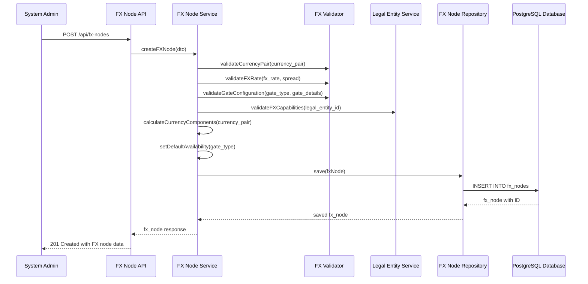

# Story 5: FX Nodes Data Model

## Title
Implement FX Nodes Data Model for Foreign Exchange Venue Management

## Description
**As a** system administrator  
**I want** to define isolated FX venues and foreign exchange nodes  
**So that** external FX providers can be modeled in the payment network with proper currency conversion, pricing, and settlement capabilities

## Acceptance Criteria

1. **Given** a system administrator needs to create an FX node, **when** they specify currency pair, provider details, and gate information, **then** the system creates an isolated FX venue with proper validation and pricing configuration

2. **Given** an FX node with a specific currency pair (e.g., USD->EUR), **when** it is configured, **then** it must include FX rate, spread, settlement time, and minimum/maximum size limits with automatic currency pair validation

3. **Given** an FX node with gate configuration, **when** it specifies entry/exit points, **then** it must include either fiat gate (IBAN) or crypto gate (blockchain address) details depending on the gate type

4. **Given** FX nodes with pricing models, **when** cost structures are defined, **then** the system supports flat fee, tiered, or included cost models with appropriate validation for each type

5. **Given** FX nodes with operational constraints, **when** availability and status are configured, **then** the system enforces settlement times, size limits, and availability windows for currency conversion operations

6. **Given** FX nodes integrated with legal entities, **when** FX provider capabilities are validated, **then** only legal entities with can_host_fx_nodes=true can host FX venues

## Architecture

### Database Schema

### FX Node Creation Flow

## Technical Design Considerations

### Security
- FX node IDs use ULIDs for secure identification
- FX rate and spread information access controlled by user permissions
- Gate configuration validation prevents invalid payment details
- Audit logging for all pricing and configuration changes
- Access control for FX node management operations

### Validation
- Currency pair format validation (ISO 4217 currency codes)
- FX rate validation within reasonable market ranges
- Spread validation (positive values within market norms)
- Gate configuration validation based on gate type (IBAN vs blockchain address)
- Legal entity capability validation for FX hosting
- Size limit validation (min_size < max_size, positive values)

### Performance
- Database indexes on node_id, currency_pair, legal_entity_id, and status
- Composite indexes for currency-specific queries (currency_in, currency_out)
- Efficient FX node lookup for payment route discovery
- Optimized queries for available FX venues by currency pair
- Caching strategy for active FX rates and availability

### Database Design
- Denormalized currency_in and currency_out fields for efficient querying
- Check constraints on positive rates, spreads, and size limits
- Enum constraints for gate_type and cost_model validation
- Foreign key constraints with legal entity validation
- Precision handling for FX rates and financial amounts

### FX Rate Management
- Current rate storage with timestamp tracking
- Spread calculation and validation against market norms
- Rate update mechanisms for real-time pricing
- Historical rate tracking preparation for audit trails
- Currency pair normalization and validation

### Gate Configuration
- Polymorphic gate design supporting both fiat and crypto entry points
- IBAN validation for fiat gates with checksum verification
- Blockchain address validation for crypto gates per network
- Network specification for multi-chain crypto support
- Gate availability coordination with FX node status

### Cost Model Implementation
- Flexible cost model support (flat fee, tiered, included)
- Fixed cost configuration with currency-appropriate precision
- Tiered pricing preparation for future volume-based pricing
- Cost calculation integration with payment method pricing
- Transparent fee disclosure for compliance requirements

### Operational Management
- Settlement time configuration with standard notation (T+0, T+1, etc.)
- Availability window management for FX venue operations
- Status management (available, unavailable, maintenance)
- Size limit enforcement for transaction validation
- Operational hour coordination with related asset nodes

### Integration Points
- Repository pattern with specialized FX query methods
- Event system for rate updates and status changes
- DTO validation with FX-specific business rules
- Swagger documentation with FX venue configuration examples
- Error handling for FX validation and operational constraints

### Scalability Considerations
- Efficient FX venue discovery for payment path algorithms
- Bulk rate update capabilities for market data integration
- Archive strategy for inactive or discontinued FX venues
- Performance optimization for real-time FX rate queries
- Horizontal scaling preparation for high-frequency FX operations
