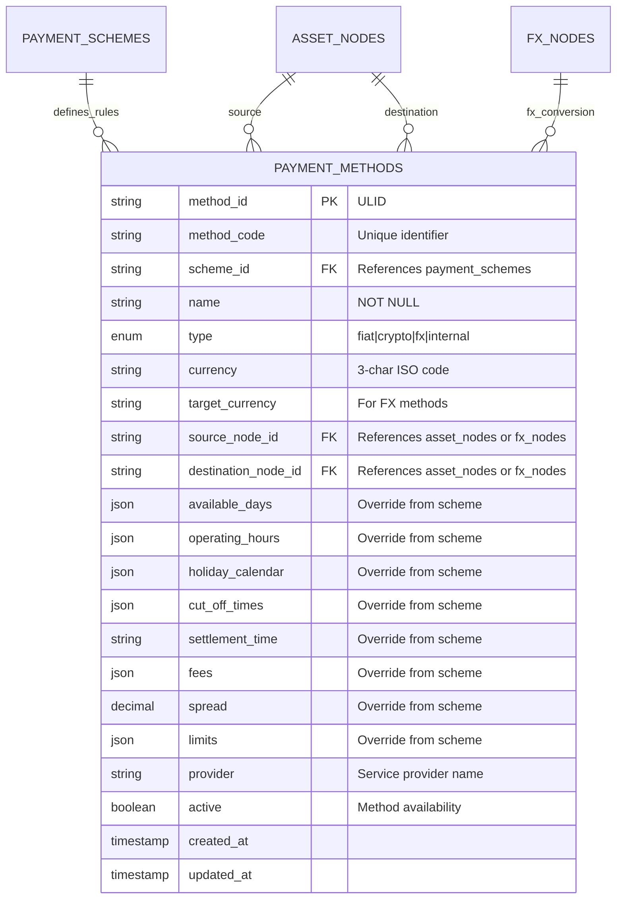
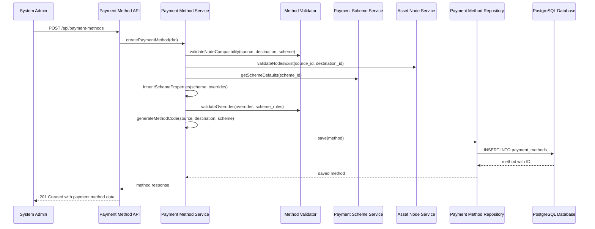
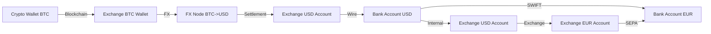

# Story 6: Payment Methods (Edges) Data Model

## Title
Implement Payment Methods as Graph Edges with Scheme Inheritance and Overrides

## Description
**As a** system administrator  
**I want** to define payment methods as directed edges connecting asset nodes  
**So that** the graph represents all possible payment routes with inherited scheme properties and method-specific overrides for fees, limits, and operational constraints

## Acceptance Criteria

1. **Given** a system administrator needs to create a payment method, **when** they specify source node, destination node, and payment scheme, **then** the system creates a directed edge with inherited scheme properties and validates node compatibility

2. **Given** a payment method inherits from a payment scheme, **when** it is created, **then** it automatically inherits operating hours, fees, limits, and settlement times from the scheme but allows for method-specific overrides

3. **Given** payment methods connecting different node types, **when** validating connections, **then** the system enforces valid edge types (bank-to-bank, crypto-to-crypto, bank-to-crypto via exchange, etc.) based on scheme compatibility

4. **Given** payment methods with override configurations, **when** method-specific parameters are set, **then** they take precedence over scheme defaults while maintaining validation rules and operational constraints

5. **Given** payment methods as graph edges, **when** querying payment routes, **then** the system efficiently discovers paths between source and destination nodes using directed edge relationships

6. **Given** payment method operational parameters, **when** time-sensitive operations occur, **then** the system enforces cut-off times, operating hours, and holiday calendars from either method overrides or scheme inheritance

## Architecture

### Database Schema

### Payment Method Creation Flow

### Graph Edge Traversal

## Technical Design Considerations

### Security
- Payment method IDs use ULIDs for secure identification
- Edge validation prevents unauthorized payment route creation
- Access control for payment method configuration and overrides
- Audit logging for all method configuration changes
- Validation of node ownership and access permissions

### Validation
- Node compatibility validation based on scheme requirements
- Currency compatibility between source/destination nodes and scheme
- Override parameter validation against scheme-defined constraints
- Circular reference detection in payment method chains
- Balance and limit validation for operational viability

### Performance
- Database indexes on method_id, scheme_id, source_node_id, destination_node_id
- Composite indexes for graph traversal queries
- Efficient edge discovery for path-finding algorithms
- Optimized queries for active payment methods by currency/type
- Graph traversal optimization using adjacency list patterns

### Database Design
- Foreign key constraints ensuring referential integrity
- Check constraints on currency compatibility and positive limits
- JSON field indexing for frequently queried override parameters
- Partial indexes for active vs inactive payment methods
- Constraint triggers for scheme inheritance validation

### Scheme Inheritance Logic
- Automatic inheritance of scheme properties at creation time
- Override precedence rules (method overrides beat scheme defaults)
- Dynamic property resolution during payment processing
- Validation of override compatibility with scheme constraints
- Change propagation when scheme properties are updated

### Graph Relationship Management
- Directed edge representation for unidirectional payment flows
- Bidirectional relationship support through paired methods
- Node degree calculation for connectivity analysis
- Edge weight calculation for pathfinding algorithms
- Disconnected component detection for network analysis

### Operational Override System
- Flexible override mechanism for all scheme properties
- Validation ensuring overrides don't violate business rules
- Default value fallback to scheme when no override specified
- Time-based override support for temporary configurations
- Bulk override operations for scheme-wide updates

### Payment Route Discovery
- Efficient graph traversal algorithms for pathfinding
- Multi-hop route discovery with intermediate conversions
- Cost calculation across multiple payment method edges
- Time-based route filtering using operational constraints
- Currency conversion path optimization through FX nodes

### Integration Points
- Repository pattern with graph-optimized query methods
- Event system for payment method status and configuration changes
- DTO validation with scheme inheritance awareness
- Swagger documentation with graph relationship examples
- Error handling for graph consistency and validation failures

### Scalability Considerations
- Efficient payment route discovery algorithms for large graphs
- Bulk payment method operations for network management
- Archive strategy for obsolete or discontinued payment methods
- Performance optimization for real-time route calculation
- Horizontal scaling preparation for high-volume payment processing

### Business Rule Enforcement
- Settlement time compatibility across connected methods
- Operating hour intersection for multi-hop routes
- Fee accumulation and limit aggregation across payment chains
- Currency conversion validation through supported FX pairs
- Regulatory compliance validation for cross-border payments
